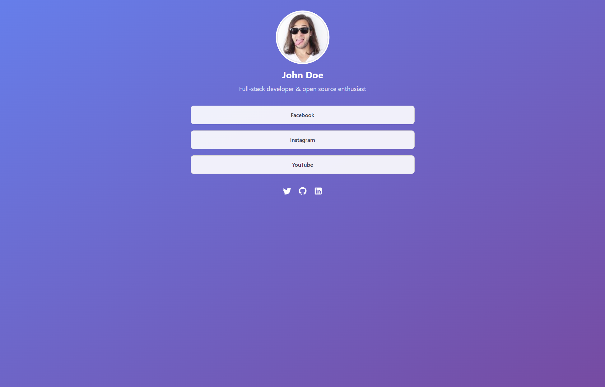
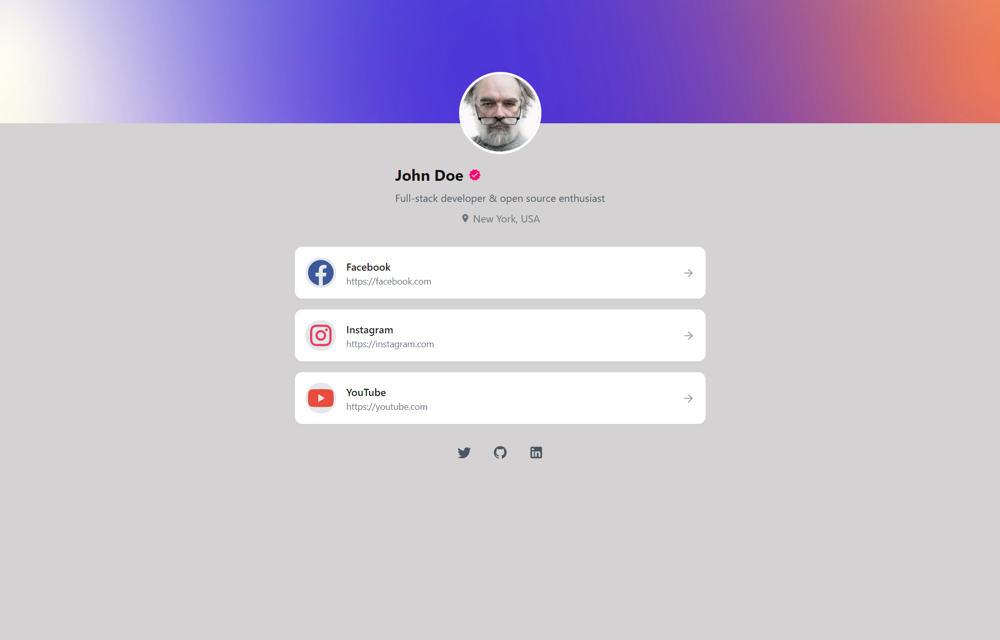
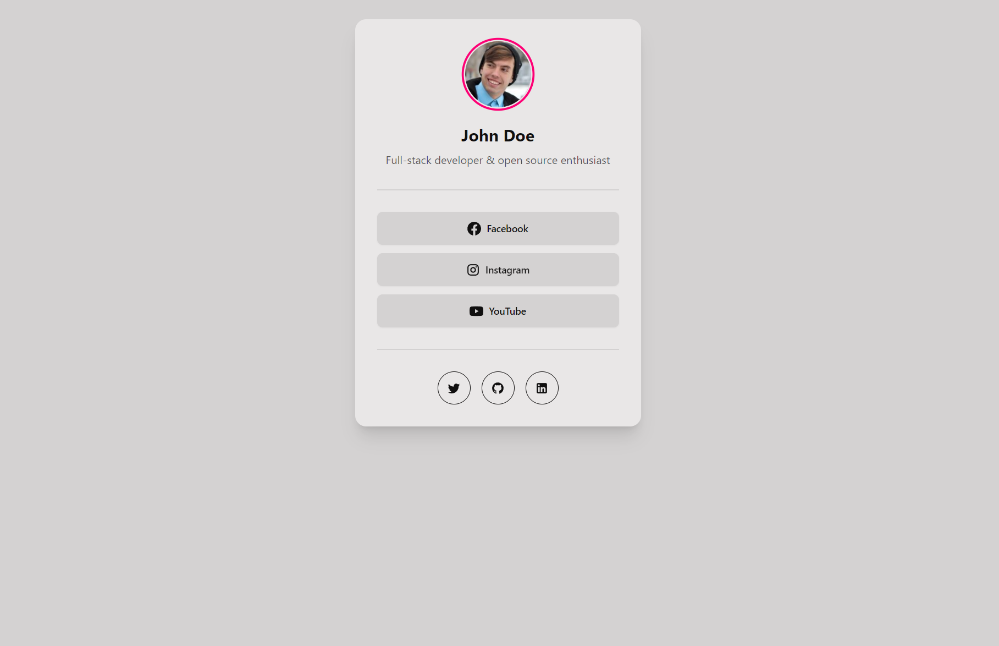

# LinkSpace

A customizable, self-hosted alternative to link-in-bio services built with Astro, AstroIcons, TailwindCSS, and DaisyUI. Create your own link landing page with multiple theme options and easy configuration.

## 🚀 Features

- 📱 Fully responsive design
- 🎨 Multiple theme options (Disco, BusinessCard, AllStars, more coming soon...)
- ⚙️ Simple YAML configuration
- 🔌 Easy to extend and customize
- 🖼️ Support for profile images and icons
- 🔗 Social media integration
- ⚡ Fast and lightweight

## 📦 Installation

1. Clone the repository:
```bash
git clone https://github.com/SeinDigital/linkspace.git
cd linkspace
```

2. Install dependencies:
```bash
npm install
```

3. Create your configuration file:
```bash
cp src/config/links.example.yaml src/config/links.yaml
```

4. Start the development server:
```bash
npm run dev
```

##  Docker 

> [!WARNING]
will be added soon

## ⚙️ Configuration

The project uses YAML for configuration. Create your `src/config/links.yaml` file with the following structure:

```yaml
fullName: Your Name
bio: Your bio or description
avatar: /path/to/avatar.jpg  # or URL
links:
  - title: Portfolio
    url: https://yourportfolio.com
    icon: mdi:briefcase  # Optional
    color: primary       # Optional
    classes: custom-class # Optional

socials:
  - title: Twitter
    url: https://twitter.com/username
    icon: mdi:twitter
```

### Configuration Options

- `fullName`: Your display name
- `theme`: Theme name 
- `page`: Page Data
  - `title`: Page title
  - `description`: Page description
  - `keywords`: Page keywords
  - `bodyClasses`: Additional CSS classes for the body tag (optional)
- `bio`: Short biography or description (optional)
- `location`: Location or city (optional)
- `avatar`: Profile image path or URL (optional)
- `bgImage`: Background image path or URL (optional)
- `bgColor`: Background color (optional)
- `links`: Array of main links
  - `title`: Link display text
  - `url`: Destination URL
  - `icon`: Icon name from installed icon sets (optional)
  - `color`: Button color variant (optional)
  - `classes`: Additional CSS classes (optional)
- `socials`: Array of social media links
  - `title`: Platform name
  - `url`: Profile URL
  - `icon`: Social media icon name
  
> [!NOTE]  
> For a extended description of how to use icons, check the [AstroIcon documentation](https://www.astroicon.dev/getting-started/). 
Astro Icons supports multiple icon sets, including Material Design Icons, FontAwesome, as a part of [Iconify project](https://icon-sets.iconify.design).

> [!TIP]
> For `classes` options, you can use any TailwindCSS classes or DaisyUI classes. 

## 🎨 Available Themes


1. Gradient Theme (`disco`)
   - Gradient background
   - Rounded card layout
   - Icon support


2. All Stars Theme (`all-stars`)
   - Banner image support
   - Card-based layout


3. Business Card Theme (`business-card`)
   - Minimalistic design
   - Background image support
   - Icon support

## 🤝 Contributing

While this is primarily a personal project, contributions are welcome! Here's how you can contribute:

1. Fork the repository
2. Create a new branch for your feature:
   ```bash
   git checkout -b feature/amazing-feature
   ```
3. Commit your changes:
   ```bash
   git commit -m 'Add amazing feature'
   ```
4. Push to your branch:
   ```bash
   git push origin feature/amazing-feature
   ```
5. Open a Pull Request

### Contribution Guidelines

- ✅ New themes are welcome
- ✅ Bug fixes
- ✅ Performance improvements
- ✅ Documentation improvements
- ❌ Breaking changes without discussion
- ❌ Major architecture changes without discussion

## 📝 License

This project is licensed under a custom non-commercial license:

- ✅ Free for personal use
- ✅ Free for non-commercial use
- ✅ Modifications and distributions must maintain the same license
- ❌ Commercial use is not permitted without explicit permission
- ❌ Reselling or redistributing as a paid product is not permitted

## 🚀 Deployment

The project can be deployed to any static hosting service. Here are some recommended options:

- Vercel
- Netlify
- AWS Amplify
- GitHub Pages
- Cloudflare Pages

Build the project for production:
```bash
npm run build
```

## 🤔 Support

If you encounter any issues or have questions:

1. Check the [Issues](https://github.com/SeinDigital/linkspace/issues) page
2. Create a new issue with detailed information about your problem
3. Provide steps to reproduce the issue

## 🙏 Acknowledgments

- Astro.js team for the amazing framework
- TailwindCSS and DaisyUI for the styling utilities

---

Made with ❤️ using [Astro](https://astro.build)